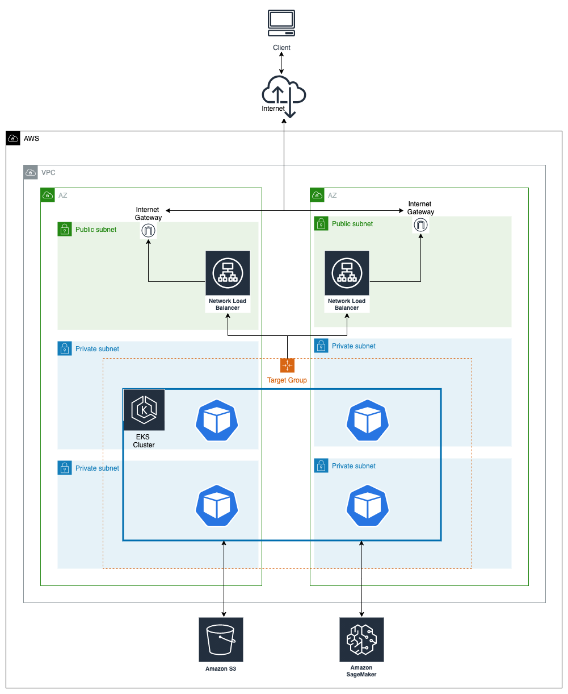
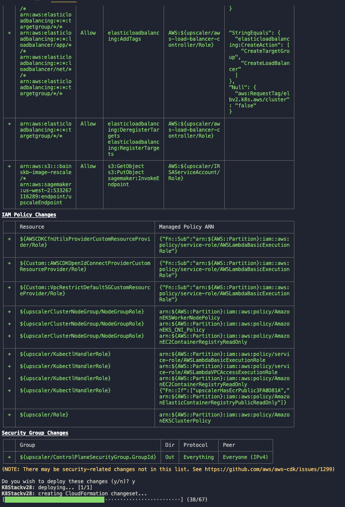
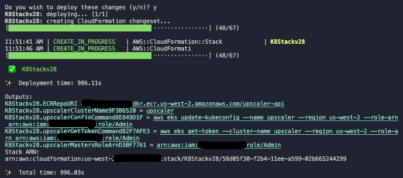
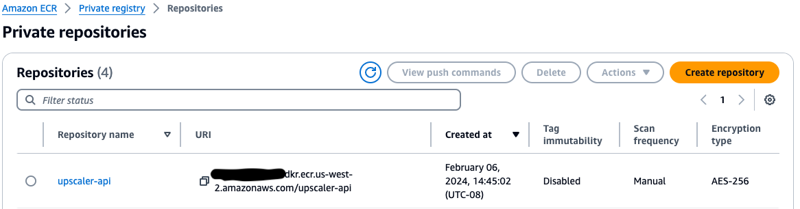
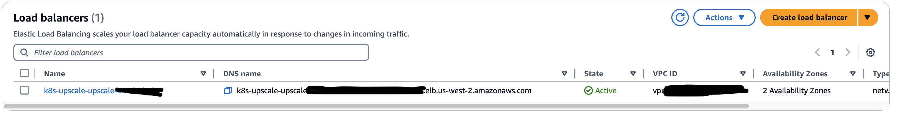
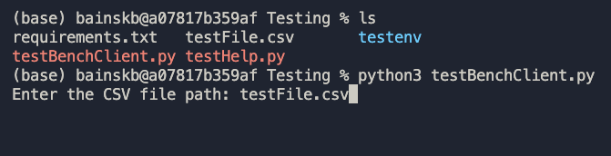
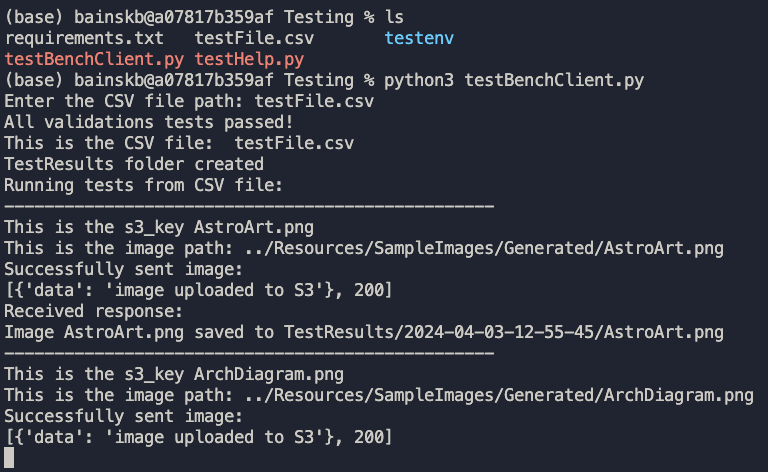
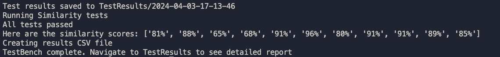

# Image Upscaling & Testing Using Generative AI

Images are used in a variety of use cases. These images need to be stored, at a cost, so they can be retrieved when needed. Depending on the sizes of these images, storage costs can be significant. By down scaling images before storing them, the size of the image file is reduced and therefore reducing the cost of storage. 
At the time of retrieval, this Upscaler can be utilized to upscale the image before use. Feasibility of this workflow is based on the use case and type of images stored. This project will provide an easy to use API to implement this workflow. 

### Upscaler Extensions:

This project utilizes a Python interface named UpscaleProvider that enforces the upscale image method in any class that implements the interface. 

The JumpStartRTUpscaleProvider Class implements the JumpStart upscale model by Stability AI. This model uses an input image and prompt to upscale the images. In this implementation, no prompt used to simplify the workflow. The model is deployable directly from the JumpStart notebooks in SageMaker studio. 

The instructions for deployment are here: https://aws.amazon.com/blogs/machine-learning/upscale-images-with-stable-diffusion-in-amazon-sagemaker-jumpstart/

Here is a video that walks through the Endpoint Deployment: https://d2908q01vomqb2.cloudfront.net/artifacts/DBSBlogs/ml-12752/upscaling_video_final.mp4?_=1


### The Model:

Stability AI is a Generative AI leader that builds its models on AWS https://press.aboutamazon.com/2022/11/stability-ai-selects-aws-as-its-preferred-cloud-provider-to-build-artificial-intelligence-for-the-future. 
The base upscale model used by JumpStart is Stable Diffusion ×4 Upscaler FP16. the “x4” is the amount the model will upscale and the FP16 stands for 16-bit floating point, which means it uses 16 bits(binary digits) to represent a number. 
This Upscaling model of Stable AI is able to work on an image and then upscale it by generating new pixels. These new pixels are incorporated into a brand new upscaled version of the original image. 


## Repo Walkthrough

### API

* The API directory contains the **Flask API** that the user interacts with. The API calls are *backed* by `downscale_s3.py` file that uses the  **JumpStart Provider** which *implements* the **Upscale Interface**.
* This directory contains the `Dockerfile` that is used to create the API container that will be used in a pod on the EKS cluster
* This directory contains a `requirements.txt` file to install all of the necessary pip packages
* This directory contains a SSL folder to store key and certificates. 

### CDK_Infra

* This CDK directory contains the CDK stack that will deploy the EKS infrastructure that will host the API for users to interact with. 
* The Infrastructure consists of:
    * VPC with Subnets
    * Network Load Balancer
    * ECR for images
    * EKS Cluster with nodes, IAM role, namespaces, and cert-manager
    * IRSA Service Account for necessary permissions for the deployment

### Client

* This directory contains a simple client that can be used to interact with the deployed API for testing or configuration purposes.  

### Testing

* The Testing directory contains the necessary python scripts to run tests against the Upscale API. 
* The `testBenchClient.py` is a specialized program to test the Upscale API
    * This program will take in a CSV of local image paths. Then it will downscale and store the images into S3, upscale the image and store it locally in a results directory, then compute a score for the “quality” of the upscale and create a results CSV file that will have the path to the new upscaled image and it’s respective score. 
    * This program will test the “quality” of the upscale of the object. It utilizes the method orb_sim(), which will compare two images. It will compare the pixels in the respective regions of the image to compare how similar the pixels are and assign it a score. The sensitivity of the similarity is measured by the distance, which is set at 50. 
* The `testHelp.py` is a helper program that takes in a local path of a folder of images and generates a CSV file for the testBenchClient program.

###  Resources

* Contains documents and instructional images that may be helpful console deployment.
> **Note:** The Console changes overtime and these images may not be up to date with newer versions of the console but still serve as a good guide 

* Sample Images are also not included but needed to run the test bench. JPG, JPEG, and PNG file format are supported. 
* Depending on the image, some may cause the model to run into Out Of Memory issues. 
* Here is a sample data set that can be used if you do not have any images to test with:
* https://www.kaggle.com/datasets/hereisburak/pins-face-recognition 


### Manifest

* Contains the manifests yaml files for K8s deployment. 

## Architecture Diagram





**Architecture notes:**

* Users are able to hit the Flask API that is hosted on EKS. 
* The users can send their images as base64 format to be down scaled and stored in their S3 bucket.
* They will then be able to retrieve the image using the S3Key which will upscale the image. The quality of the upscaled image as compared to the down scaled image depends on the original input image.
> **CAUTION**  This solution uses a Public Load Balancer and limits the IP range using network Security Group, make sure to correctly set personal IP address or ELB may be open to the public!

## Pre- Requirements
### Installations
* Latest version of AWS CLI installed: https://docs.aws.amazon.com/cli/latest/userguide/getting-started-install.html
* Docker: https://docs.docker.com/engine/install/
* Python: https://www.python.org/downloads/
* Node & npm: https://docs.npmjs.com/downloading-and-installing-node-js-and-npm
* kubectl: https://kubernetes.io/docs/tasks/tools/


### Deployed Infrastructure
* S3 bucket created to store the down scaled images: https://docs.aws.amazon.com/AmazonS3/latest/userguide/creating-bucket.html
* Have a JumpStart SageMaker real-time endpoint deployed:
    * Instructions of deployment: https://aws.amazon.com/blogs/machine-learning/upscale-images-with-stable-diffusion-in-amazon-sagemaker-jumpstart/
    * https://github.com/aws/amazon-sagemaker-examples/blob/main/introduction_to_amazon_algorithms/jumpstart_upscaling/Amazon_JumpStart_Upscaling.ipynb
    * https://d2908q01vomqb2.cloudfront.net/artifacts/DBSBlogs/ml-12752/upscaling_video_final.mp4?_=1
    > **Note:** You can also follow the images in the Resources/Documentation/SageMaker folder, there are in order and titled, but the UI might change overtime. Also, you can delete the endpoint after done testing to save expenses and then redeploy the endpoint from an endpoint configuration that will be created automatically after you first deploy using the instructions. 

## Deployment Instructions:

### CDK

1) Install CDK. Review the [AWS Documentation](https://docs.aws.amazon.com/cdk/v2/guide/getting_started.html) on how to do this.

```
npm install -g aws-cdk
```


2) Bootstrap CDK. Ensure you put your ACCOUNT-NUMBER and REGION (e.g. us-east-1).

```
cdk bootstrap aws://ACCOUNT-NUMBER/REGION
```

3) Configure the CDK Environment (optional)

* First you need to make sure that the stack is configured with your proper Account Number and Region. By default CDK will use your environment variables if you are using an AWS CLI profile, if you want to specify a region you override it by changing the values in the CDK stack. 
    * Navigate to `CDK_Infra/bin/cdk.ts`
    * Alter the name of the CDK stack and alter the ENV values to the proper account number and region

```
/* Uncomment the next line if you know exactly what Account and Region you
 * want to deploy the stack to. */
// env: { account: '123456789012', region: 'us-east-1' },
```

4) Configure the CDK Stack (AWS Resources)

* Second you need to make sure the cdk stack has the proper deployment values
    * Navigate to  `CDK_Infra/bin/lib/cdk-stack.ts`
    * Add the value of your SageMaker real-time instance and S3 Bucket near line 110

```
resources: [
  // SageMaker endpoint ARN goes here:
  // "<SageMaker ARN>",
  "arn:aws:sagemaker:us-west-2:************:endpoint/upscaleendpoint",
  // S3 Bucket ARN goes here:
  // "<S3 Bucket ARN>"
  "arn:aws:s3:::s3-bucket-name-here/*"
]
```

5) Configure the CDK Stack (EKS Cluster)

* Alter the value of the instances depending on your machine near line 120

```
    // If you are on an x86 Machine change the instance type. 
    // const x86InstanceType = ec2.InstanceType.of(ec2.InstanceClass.M5, ec2.InstanceSize.XLARGE)  
    const ARMInstanceType = ec2.InstanceType.of(ec2.InstanceClass.M7G, ec2.InstanceSize.XLARGE)
    
    //This will create the NodeGroup in the cluster
    const upscalerClusterNodeGroup = new eks.Nodegroup(this, 'upscalerClusterNodeGroup', {
      nodegroupName: "upscalerClusterNodeGroup",
      cluster: upscalerCluster,
      minSize: 4,
      maxSize: 4,
      instanceTypes: [
        ARMInstanceType
      ]
    });
```

6) Deploy the CDK package.
> **Note:** This will take 5-10 mins to deploy all of the resources. 

```
cd CDK_Infra
npm install
cdk deploy 
```

* Results should look like the following




7) Once the CDK stack is completely deployed, navigate to the ECR page in the Management console to view the newly created repository 
> **Note:** Make sure to use the correct ECR repo it should look something like this: `012345678910.dkr.ecr.us-east-1.amazonaws.com/upscaler-api` you will need to copy and save the value of the ECR for the next portion




### Docker Container and ECR

Once the CDK is deployed the infrastructure will be deployed in the AWS Cloud. This portion of the instructions will walk you through building the API image, pushing the image to the ECR, connecting to the EKS cluster, and lastly configuring the EKS cluster with a service, deployment, and cert. 

1) Build and push Docker Image

```
cd API
```

2) Build the image

```
 docker build . -t {ECR}:latest
```

3) Authenticate ECR with Docker

```
 aws ecr get-login-password --region <REGION> | docker login --username AWS --password-stdin {ECR}
```

4) Push to Image to ECR

```
docker push {ECR}:latest
```

### EKS 
1) Set up local kubectl config

> **Note:** Make sure that you have the latest aws-cli and kubectl installed for the context to update automatically, otherwise you will have to manually edit the apiVersions within the kubernetes file

```
aws eks update-kubeconfig --name upscaler
```

2) Deploy the Manifests 

```
cd Manifest
```

3) Create the Certificate Manager 

```
kubectl apply -f cert.yaml
```
> **Note:** This is a self signed certificate. If you want to use in production make sure to get a CA signed certificate. 

4) Create the Deployment

* Configure the `deployment.yaml` file before deploying by changing the image of the deployment to your own `{ECR}`

```
image: 1234567890.dkr.ecr.us-east-1.amazonaws.com/upscaler-api:latest
```

```
kubectl apply -f deployment.yaml
```

5) Create the Service  

* Configure the `service.yaml` file before deploying by uncommenting and changing the source range IP Address of the service to your own IP Address.
> **DISCLAIMER:** Make sure that you add only your IP address with the /32 notation or else the endpoint will be open to public and prone to attacks. 


```
loadBalancerSourceRanges:
- "x.x.x.x/32"
```

```
kubectl apply -f service.yaml
```

###  Test Bench

1) Configure the Test Bench

```
cd Testing
```

2) Install the requirements 
> **Note:** To avoid dependency issues it is best practice and recommended you use a virtual environment to install your dependencies. Virtual environment instructions may vary depending on your machine and python location. 

```
#macOS 
virtualenv -p /opt/homebrew/bin/python3.12 testenv

source testenv/bin/activate
```
```
#windows 
virtualenv --python C:\Python312\python.exe testenv

.\testenv\Scripts\activate

```

```
pip install -r requirements.txt
```

3) Include your `endpoint` and `s3Bucket` **NAME** of the resources that you passed into the CDK at the top of the `testBenchClient.py`.
> **Note:** This will be the **NAME** and NOT the ARN for both resources

```
# TestBench Inputs
# Make sure your inputs  match the deployment you are testing against
s3_bucket = "<S3_BUCKET_NAME>"
endpoint = "<SAGEMAKER_ENDPOINT_NAME>"
```

4) At the top of the `testBenchClient.py` file make sure you have included your Elastic Load Balancer URL, this can be found in the AWS management console in the side menu of the EC2 page under Load Balancers:

```
ELB_DNS = "k8s-upscale-upscale-<ELB_ID>.elb.<REGION>.amazonaws.com"
HTTPS = "https://"
API_URL = HTTPS + ELB_DNS
```



5) Create CSV file 

> **Note:** The testBench requires a CSV file with local paths to images that will be used in the tests. There is an included program that will take in the local path of a folder with images and create the the CSV file for you. 

* The `testHelp.py` program will request a path to a directory of images, it will use this directory to create the CSV file. 
* It is suggested you places your folder of images in the Resources directory for convenience. The path will be relative to the location of the Testing directory.  
* The output CSV file will be titled `testFile.csv`

```
python testHelp.py
```

6) Run the TestBench

> **Note:** This program will create a TestResults folder to store all of the results each time you run the program. Each time you run the program a new folder entitled with the timestamp will be created. The result folder will have the upscaled images and a CSV file titled testResults.csv

```
python testBenchClient.py
```

#### Start


#### Running


#### Done


### Teardown

1) Destroy the CDK stack:

> **Note:** On the destroy, you should first delete ecr image before deleting the stack. There may be other dependencies including having to delete ENIs before being able to delete the VPC. 

```
cd CDK_INFRA
cdk destroy
```

